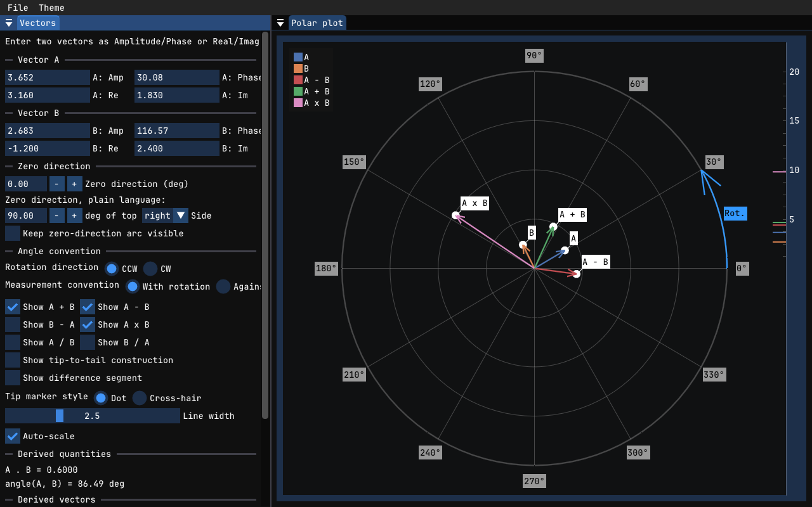
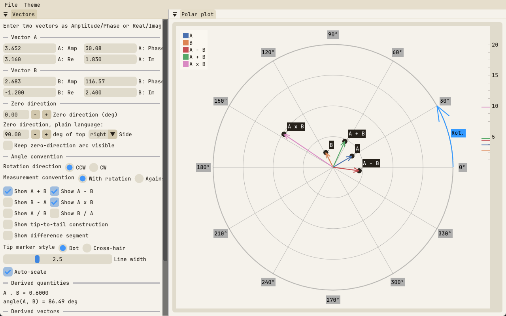
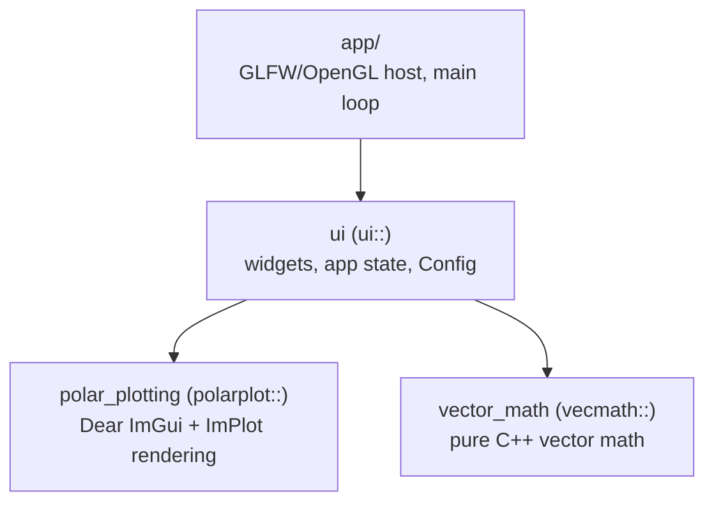

# polar-plotter

Interactive desktop tool for learning 2D vector math: enter vector quantities,
plot them on a polar canvas, and see vector operations (sum, difference, dot
product, angle between) update live. Built with Dear ImGui + ImPlot.

|                                        |                                        |
| -------------------------------------- | -------------------------------------- |
|  |  |

## Features

- **Two input styles, live-converted**: enter each vector as
  Amplitude/Phase or Real/Imaginary — both stay in sync as you type — or
  drag a vector's tip directly on the plot.
- **Derived vectors, each independently toggleable**: sum, difference (both
  `A − B` and `B − A`), and the complex product/quotient (treating each
  vector as a complex number: amplitude multiplies/divides, phase
  adds/subtracts).
- **Configurable angle convention**: choose where 0° points — numerically or
  in plain language (e.g. "45° right of top") — and which way angles
  increase (rotation direction + measurement convention).
- **Geometric proof aids**: tip-to-tail construction and a difference-segment
  overlay show *why* a sum/difference vector is where it is, and a
  persistent zero-direction arc documents a specific angle for a screenshot.
- **Five built-in themes** (dark and light, including the "Paper" theme
  above), and your last-used vectors/settings are remembered between runs.

## Requirements

- Clang with C++23 support
- CMake >= 3.24
- Ninja
- OpenGL/X11 development libraries (Linux only — GLFW is built X11-only for now)

All other dependencies (GLFW 3.4, Dear ImGui v1.92.9b, ImPlot v1.0, Catch2
v3.7.1) are fetched and pinned automatically by `cmake/Dependencies.cmake` —
no need to install them separately.

Supported platforms: Linux, Windows (MSYS2 `clang64`), and macOS.

## Building

Configure and build with the provided CMake presets. There's a preset for
each build type — use whichever you need:

**Debug** (default for day-to-day development and testing):

```sh
cmake --preset debug
cmake --build --preset debug
```

**Release** (optimized, `RelWithDebInfo`):

```sh
cmake --preset release
cmake --build --preset release
```

Each preset configures its own build directory (`build/debug`,
`build/release`), so you can have both set up at once and rebuild either
independently.

If the unversioned `clang`/`clang++` isn't on your `PATH` (common on Linux),
point CMake at the versioned binaries instead, for either preset:

```sh
cmake --preset debug -D CMAKE_CXX_COMPILER=clang++-21 -D CMAKE_C_COMPILER=clang-21
cmake --preset release -D CMAKE_CXX_COMPILER=clang++-21 -D CMAKE_C_COMPILER=clang-21
```

There's also an `asan` preset (debug build instrumented with ASan + UBSan),
configured and built the same way:

```sh
cmake --preset asan
cmake --build --preset asan
```

## Running

After building, the executable is at `build/<preset>/app/polar-plotter`:

```sh
./build/debug/app/polar-plotter    # debug build
./build/release/app/polar-plotter  # release build
```

### Headless screenshot mode

For environments without a usable display, set `POLAR_PLOTTER_SCREENSHOT` to
render a few frames to a hidden window and dump the framebuffer as a PPM
image, then exit:

```sh
POLAR_PLOTTER_SCREENSHOT=out.ppm ./build/debug/app/polar-plotter
```

On a headless machine, wrap the command with `xvfb-run` and force the
software GL renderer:

```sh
LIBGL_ALWAYS_SOFTWARE=1 xvfb-run POLAR_PLOTTER_SCREENSHOT=out.ppm ./build/debug/app/polar-plotter
```

Convert the PPM to a viewable format with ImageMagick:

```sh
magick out.ppm out.png
```

## Testing

Run the Catch2 test suite via CTest:

```sh
ctest --preset debug
```

Run a single test by name:

```sh
./build/debug/tests/vector_math_tests "<test name>"
```

or filter by regex through CTest:

```sh
ctest --preset debug -R <regex>
```

## Releases

Pushing a version tag (`vX.Y.Z`) triggers `.github/workflows/release.yml`,
which builds a Release binary on Linux, macOS, and Windows and attaches them
to a GitHub Release for that tag:

- **Linux** (`polar-plotter-linux-x86_64.tar.gz`): x86_64, dynamically links
  the system's OpenGL/X11 (present on any Linux desktop).
- **macOS** (`polar-plotter-macos-arm64.tar.gz`): Apple Silicon only — GitHub's
  macOS runners are arm64, so there's no Intel build; build from source on
  an Intel Mac.
- **Windows** (`polar-plotter-windows-x86_64.zip`): a single statically
  linked `.exe` with no MSYS2 runtime DLLs to install alongside it.

```sh
git tag v0.1.0
git push origin v0.1.0
```

## Architecture

One-way module dependency graph — each module only depends on what's below
it, never sideways or back up:



`polar_plotting` depends on nothing but Dear ImGui and ImPlot — not on
`vector_math` or `ui` — so it's meant to be liftable wholesale into another
project: copy `src/polar_plotting/` (its `include/polar_plotting` and `src/`
plus its `CMakeLists.txt`), and convert your own vector/point type to its
`polarplot::Point` at the call site, the same way `ui` does today.

Each module lives at `src/<name>/{include/<name>/*.hpp, src/*.cpp}` with its
own `CMakeLists.txt` exporting a `polar_plotter::<name>` alias target.

## Development approach

Built collaboratively with [Claude Code](https://claude.com/claude-code)
using an agent-skills workflow, in the spirit of Matt Pocock's approach to
structuring AI coding sessions: strict TDD (a failing Catch2 test before any
production code), a domain glossary (`CONTEXT.md`) and ADRs (`docs/adr/`)
kept current as design decisions are made, and a "grilling" step that
interrogates a plan before implementation rather than after. CI (GitHub
Actions) builds and tests on Linux, macOS, and Windows (MSYS2 `clang64`) on
every push/PR, plus a separate `clang-format`/`clang-tidy` lint job.

## License

MIT — see [LICENSE](LICENSE).

Bundled dependencies keep their own licenses: [Dear
ImGui](https://github.com/ocornut/imgui) and
[ImPlot](https://github.com/epezent/implot) (MIT), [GLFW](https://www.glfw.org/)
(zlib/libpng), [Catch2](https://github.com/catchorg/Catch2) (Boost Software
License 1.0, test-only — not part of the built application), and
[JetBrains Mono](https://www.jetbrains.com/lp/mono/) (SIL Open Font License
1.1), embedded into the binary as the app's default font.
